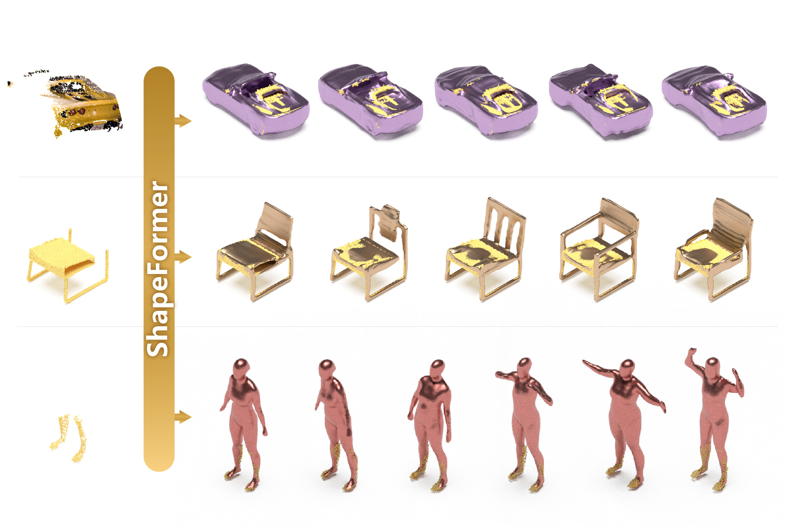

# ShapeFormer: Transformer-based Shape Completion via Sparse Representation



https://user-images.githubusercontent.com/5100481/150949433-40d84ed1-0a8d-4ae4-bd53-8662ebd669fe.mp4

### [Project Page](https://shapeformer.github.io/) | [Paper (ArXiv)](https://arxiv.org/pdf/)
<!-- | [Pre-trained Models](https://www.dropbox.com/s/we886b1fqf2qyrs/ckpts_ICT.zip?dl=0) :fire: |  -->

**This repository is the official pytorch implementation of our paper, *ShapeFormer: Transformer-based Shape Completion via Sparse Representation*.**

[Xinggaung Yan](http://yanxg.art)<sup>1</sup>,
[Liqiang Lin](https://vcc.tech/people-4)<sup>1</sup>,
[Niloy Mitra](http://www0.cs.ucl.ac.uk/staff/n.mitra/)<sup>2</sup>,
[Dani Lischinski](https://www.cs.huji.ac.il/~danix/)<sup>3</sup>,
[Danny Cohen-Or](https://danielcohenor.com/)<sup>4</sup>,
[Hui Huang](https://vcc.tech/~huihuang)<sup>1†</sup> <br>
<sup>1</sup>Shenzhen University, <sup>2</sup>University College London, <sup>3</sup>Hebrew University of Jerusalem, <sup>4</sup>Tel Aviv University


## :hourglass_flowing_sand: Code is coming soon!
- [ ] Release code
- [ ] Add Google Colab

## :notebook_with_decorative_cover: Citation

If you find our work useful for your research, please consider citing the following papers :)

```bibtex
@article{yan2021shapeformer,
  author    = {Yan, Xingguang and Lin, Liqiang and Mitra, Niloy and Lischinski, Dani and Cohen-Or, Danny and Huang, Hui},
  title     = {Shapeformer: Transformer-based Shape Completion via Sparse Representation},
  journal   = {ArXiv},
  year      = {2021},
}
```

## 📢: Shout-outs
The architecture of our method is inspired by [ConvONet](https://github.com/autonomousvision/convolutional_occupancy_networks), [Taming-transformers](https://github.com/CompVis/taming-transformers) and [DCTransformer](https://github.com/benjs/DCTransformer-PyTorch).
Thanks to the authors.

Also, make sure to check this amazing transformer-based image completion project([ICT](https://github.com/raywzy/ICT))!

## :email: Contact

This repo is currently maintained by Xingguang ([@qheldiv](https://github.com/qheldiv)) and is for academic research use only. Discussions and questions are welcome via qheldiv@gmail.com. 
